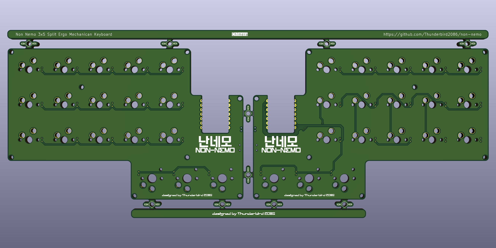
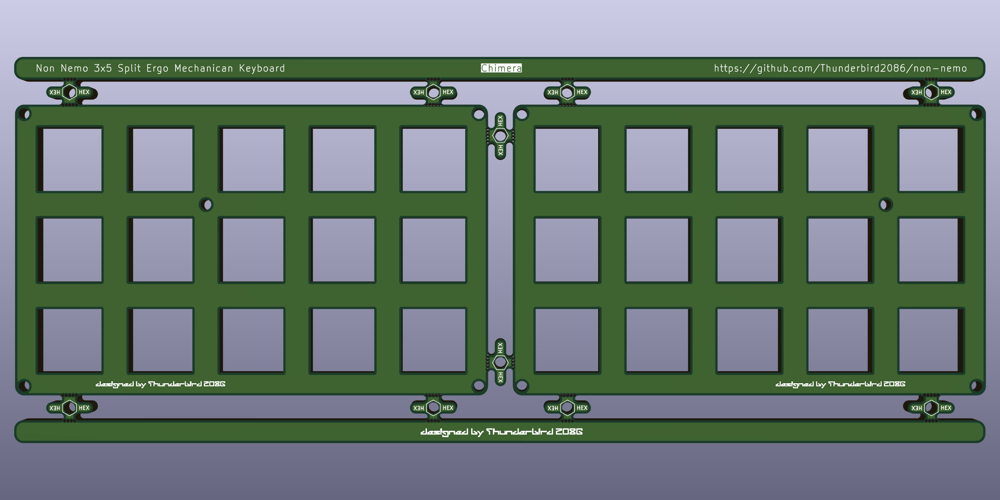

# 난네모 Chimera

## BOM
| **Component**       | **Quantity** | **Description**  |
|---                  |---:          |---               |
| Xiao BLE            | 2            | MCU              |
| 1N4148W             | 36           | SMD 1206 SOD-123 |
| MX Hotswap sockets  | 30           | Hotswap sockets compatible with MX switches |
| MX Keyswitches      | 30           | MX compatible keyswitches |
| MX Key caps         | 30           | MX compatible keycaps |
| Choc Hotswap sockets| 6            | Hotswap sockets compatible with Choc switches |
| Choc Keyswitches    | 6            | Choc compatible keyswitches |
| Choc Key caps       | 6            | Choc compatible keycaps |
| PCB                 | 1            | MX Profile      |
| Switch              | 2            | SPDT PCM12      |
| 2P connector        | 2            | Molex Pico EZmate 78171 |
| top plate MX        | 1            | [Chimera](../plates/chimera/) |
| top plate           | 1            | [Chimera](../plates/chimera/) |
| bottom plate        | 1            | [Chimera](../plates/chimera/) |
| M2 screw	          | 32           | M2x5mm          |
| M2 spacer           | 16           | M2x5mm          |
| M2 standoff         | 10           | M2x3mm          |
| LiPo battery        | 2            | 3.7V 500mAh 303450 |
| Rubber foot         | 8            | 8x3mm           |

Opitinal parts
| **Component**        | **Quantity** | **Description**  |
|---                   |---:          |---               |
| Tactile Push Button  | 2            | SMD 2x4x3.5mm    |
| Pogopin 1x2          | 2            | Height 5mm       |
| Pogopin 1x2          | 4            | Height 4mm       |

## PCB

## Case
### Plates

