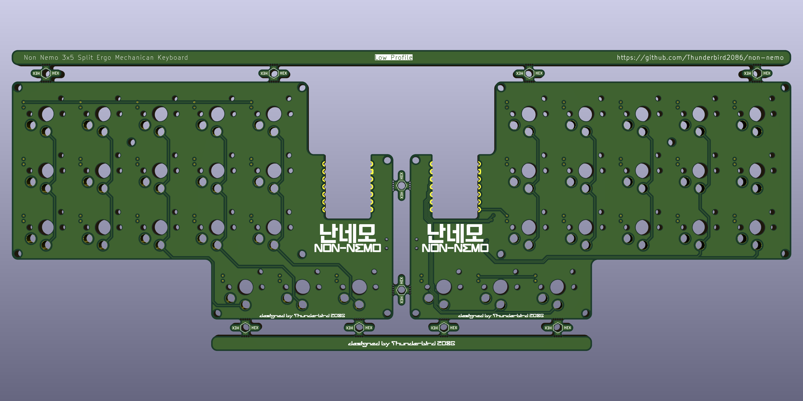
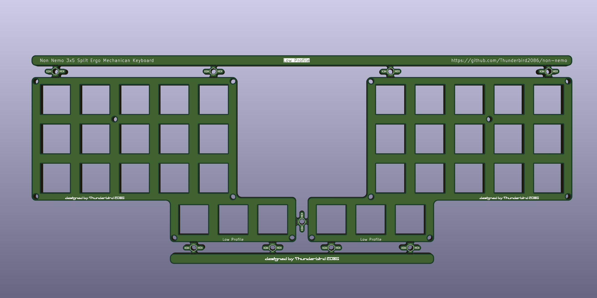
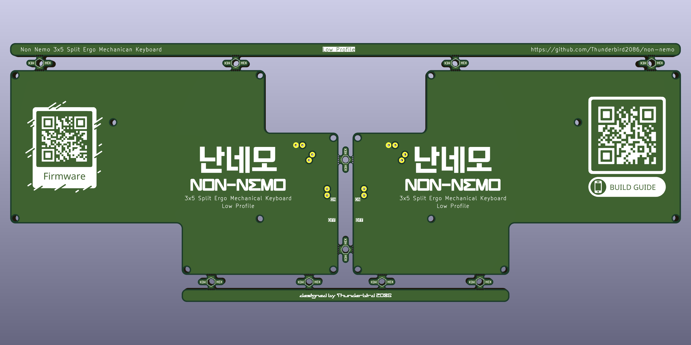

# 난네모 Low Profile

## BOM
| **Component**       | **Quantity** | **Description**  |
|---                  |---:          |---               |
| Xiao BLE            | 2            | MCU              |
| 1N4148W             | 36           | SMD 1206 SOD-123 |
| Choc Hotswap sockets| 36           | Hotswap sockets compatible with Choc switches |
| Choc Keyswitches    | 36           | Choc compatible keyswitches |
| Choc Key caps       | 36           | Choc compatible keycaps |
| PCB                 | 1            |                 |
| Switch              | 2            | SPDT PCM12      |
| 2P connector        | 2            | Molex Pico EZmate 78171 |
| top plate           | 1            | [Low Profile](../plates/low-profile/top.kicad_pro)                |
| bottom plate        | 1            | [Low Profile](../plates/low-profile/bottom.kicad_pro)                |
| M2 screw	          | 32           | M2x5mm          |
| M2 spacer           | 16           | M2x5mm          |
| LiPo battery        | 2            | 3.7V 500mAh 303450 |
| Rubber foot         | 8            | 8x3mm           |

## PCB

## Case
### Plates

