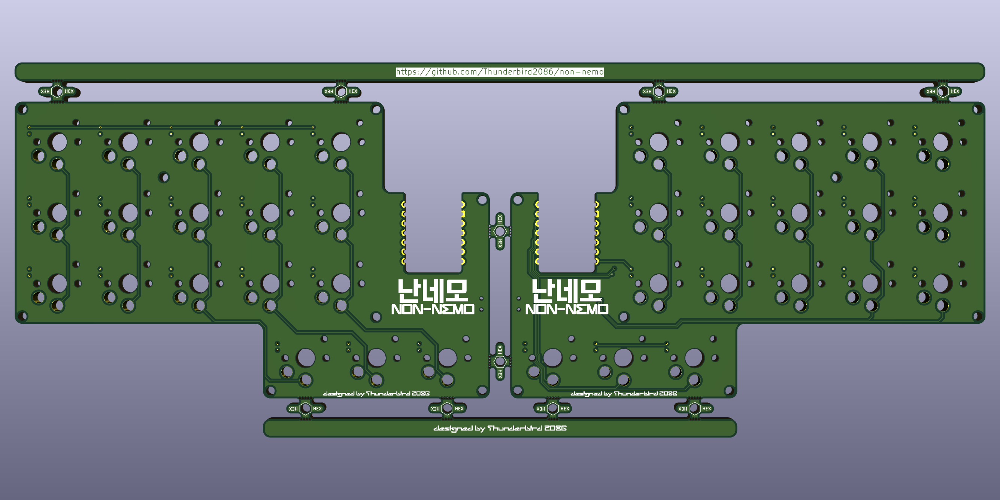
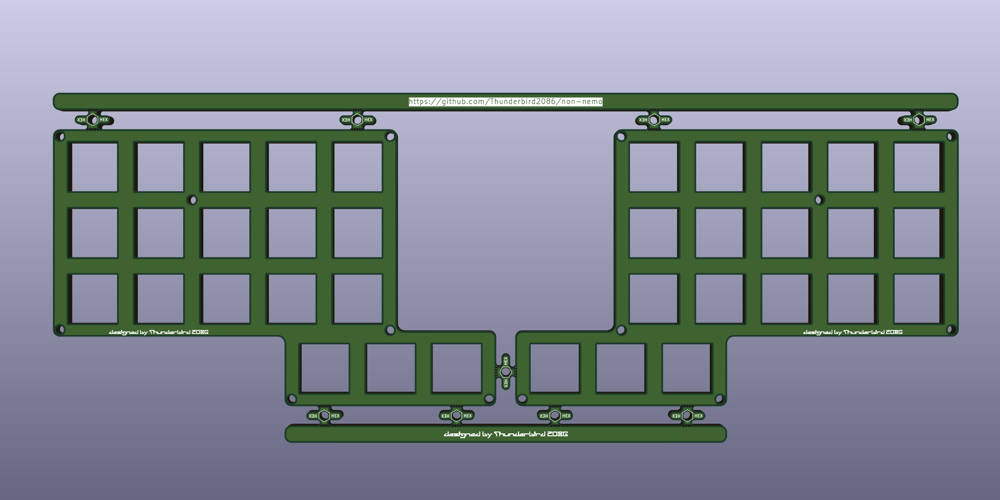
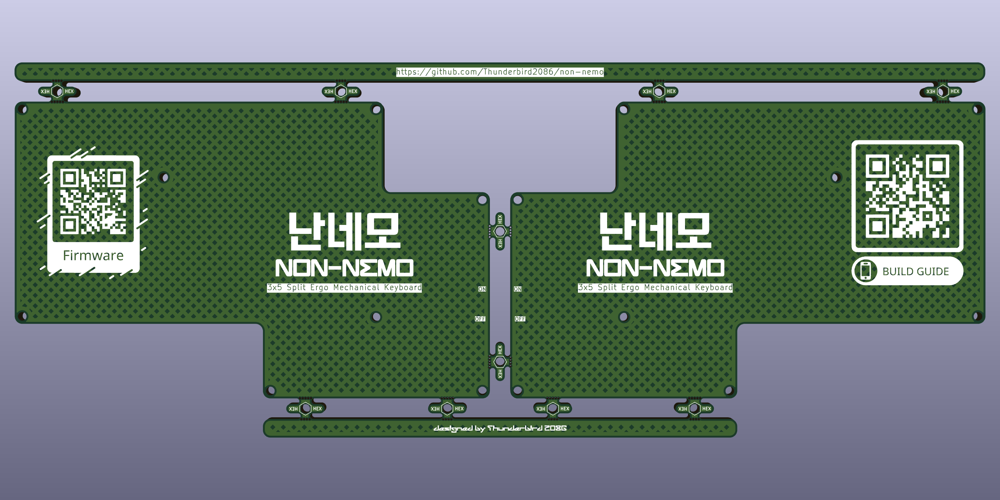

# 난네모 Low Profile

## BOM
| **Component**      | **Quantity** | **Description**  |
|---                 |---:          |---               |
| Xiao BLE           | 2            | MCU              |
| 1N4148W            | 36           | SMD 1206 SOD-123 |
| Cho Hotswap sockets| 36           | Hotswap sockets compatible with Choc switches |
| Cho Keyswitches    | 15           | Choc compatible keyswitches |
| Cho Key caps       | 15           | Choc compatible keycaps |
| PCB                | 1            |                 |
| top plate          | 1            |                 |
| bottom plate       | 1            |                 |
| M2 screw	         | 32           | M2x5mm          |
| M2 standoff        | 16           | M2x5mm          |
| Rubber foot        | 8            | 8x3mm           |

## PCB

## Case
### Plates

