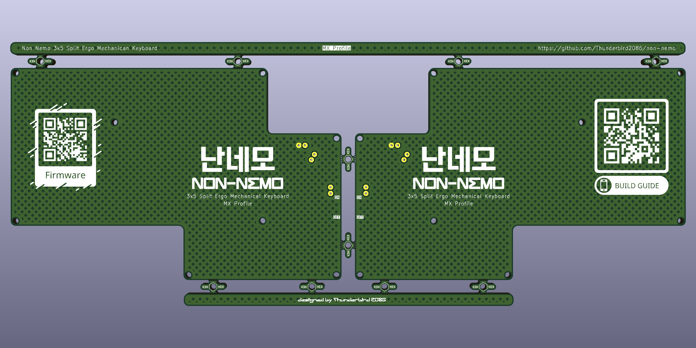

# 난네모 MX Profile

## BOM
| **Component**      | **Quantity** | **Description**  |
|---                 |---:          |---               |
| Xiao BLE           | 2            | MCU              |
| 1N4148W            | 36           | SMD 1206 SOD-123 |
| MX Hotswap sockets | 36           | Hotswap sockets compatible with MX switches |
| MX Keyswitches     | 36           | MX compatible keyswitches |
| MX Key caps        | 36           | MX compatible keycaps |
| PCB                | 1            | MX Profile      |
| Switch             | 2            | SPDT PCM12      |
| 2P connector       | 2            | Molex Pico EZmate 78171 |
| top plate          | 1            | [MX Profile](../plates/mx/) |
| bottom plate       | 1            | [MX Profile](../plates/mx/) |
| M2 screw	         | 32           | M2x5mm          |
| M2 spacer          | 16           | M2x5mm          |
| M2 standoff        | 14           | M2x3mm          |
| LiPo battery       | 2            | 3.7V 500mAh 303450 |
| Rubber foot        | 8            | 8x3mm           |

Opitinal parts
| **Component**        | **Quantity** | **Description**  |
|---                   |---:          |---               |
| Tactile Push Button  | 2            | SMD 2x4x3.5mm    |
| Pogopin 1x2          | 2            | Height 5mm       |
| Pogopin 1x2          | 4            | Height 4mm       |

## PCB

## Case
### Plates

